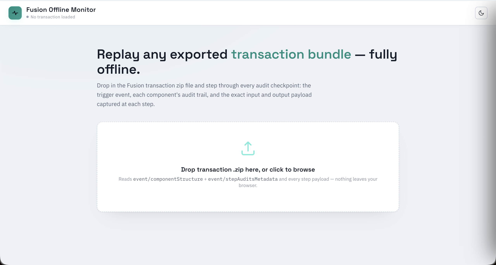
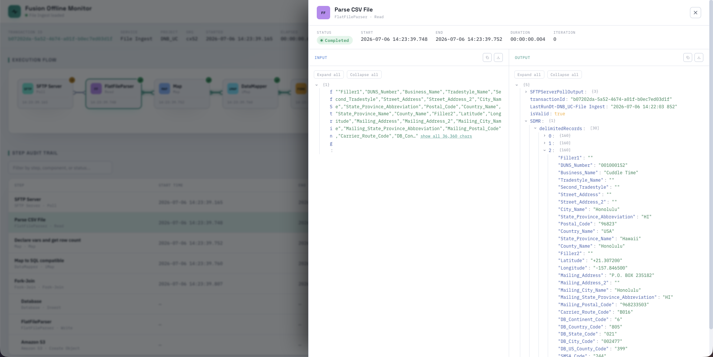

# Amplify Fusion Offline Transaction Audit and Payload Viewer

A web app to view Amplify Fusion [transaction data](https://github.com/lbrenman/amplify-fusion-transactions) retrieved from a fusion dataplane efs. Useful for support teams aiding in debugging integrations. Note that the transaction data most likely contains highly sensitive information so treat with care.

The web app can be accessed [here](https://lbrenman.github.io/Amplify-Fusion-Offline-Transaction-Audit-and-Payload-Viewer/).

Import the transaction zip file and click on the audit steps to view payload data.

